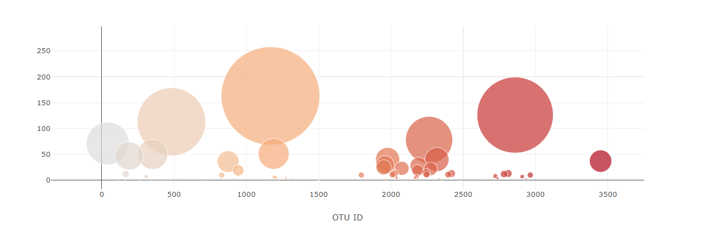
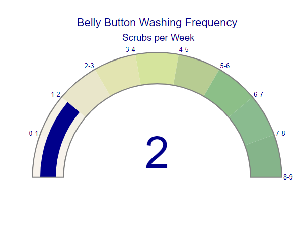

# Plotly_Challenge

In this project, I have built an interactive dashboard to explore the [Belly Button Biodiversity dataset](http://robdunnlab.com/projects/belly-button-biodiversity/), which catalogs the microbes that colonize human navels.

The dataset reveals that a small handful of microbial species (also called operational taxonomic units, or OTUs, in the study) were present in more than 70% of people, while the rest were relatively rare.

Project is deployed at :
[**Website Link**] : [https://tejalkotkar.github.io/Plotly_Challenge/Biodiversity](https://tejalkotkar.github.io/Plotly_Challenge/Biodiversity)

#### Tools:
This project is achieved by using HTML & Plotly in combination with D3 & javascript

### Dataset:
Dataset is in form on json file named samples.json 
* [Data](Biodiversity/samples.json)

### About the Data:

Hulcr, J. et al.(2012) _A Jungle in There: Bacteria in Belly Buttons are Highly Diverse, but Predictable_. Retrieved from: [http://robdunnlab.com/projects/belly-button-biodiversity/results-and-data/](http://robdunnlab.com/projects/belly-button-biodiversity/results-and-data/)

#### Insructions 
* [Instructions](Instructions/Instructions.md)

### Details:
The final application can be reached at [https://tejalkotkar.github.io/Plotly_Challenge/Biodiversity](https://tejalkotkar.github.io/Plotly_Challenge/Biodiversity) which is hosted with the help of github pages.

#### Dahboard elements & Technical Details:

**1) Default View:** 
   When the dashboard is loaded calls init() function, which loads the dropdown with all available ids & displays demographics & charts for the first id in the list which is 940. 
   

**1) Demographics:**
    Each time the dropdown selection is updated, calls a function optionChanged which takes id as parameter and filters the metadata & samples for selected id.
    optionChanged function calls three functions, one of them is to display demographic info:
    #### **getMetadata** : This function takes filtered metadata object as parameter & displays the demographic info about selected id.
    

**2) Bar Graph:**
    Another function that is invoked after the getMetadata fucntion from an optionChanged function is getPlot which takes filteres samples object for selected id.
    This function has two parts, one of it displays the Bar Graph:
    Bar graph is pretty simple, it is a generic plotly horizontal bar chart.
    For Bar chart, have taken only the top 10 values and added lables as hover over text.
    

**3) Bubble Chart:**
    The second part of the getPlot function displays the Bubble chart on the dashboard. The plot considers only two variables: otu_id and sample_values
    Used a generic bubble chart with not much manipulation.
    

**4) Gauge Chart:**
    Another function that is invoked after the getMetadata & getPlot fucntion from an optionChanged function is, getGauge. Which takes only washingfrequency as a parameter.
    This chart needed little bit manipulation(additional parameters) than basic Gauge chart. Followed the single-page-reference for Indicator Trace to add additional parameters.
    
